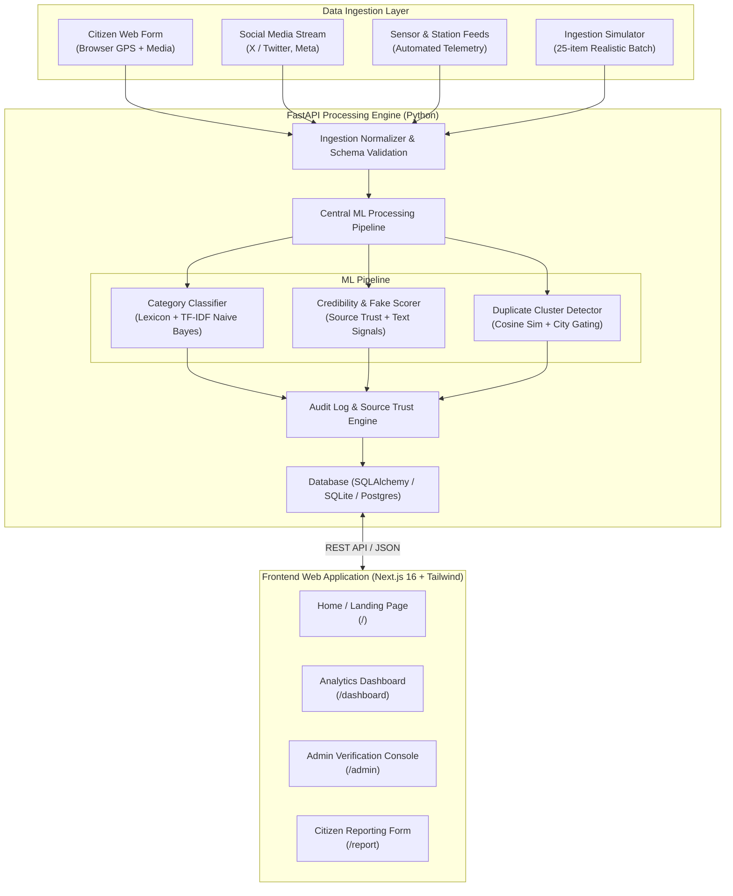

# 🌩️ MeghSetu (मेघसेतु)

### National Weather Big Data Analytics Platform

[](https://nextjs.org/)
[](https://reactjs.org/)
[](https://www.typescriptlang.org/)
[](https://tailwindcss.com/)
[](https://fastapi.tiangolo.com/)
[](https://www.python.org/)
[](https://scikit-learn.org/)
[](https://leafletjs.com/)

---

## 📌 Problem Statement & Overview

**Smart India Hackathon (SIH 2026) · Problem Statement 26069**  
**Category:** Software | **Theme:** Disaster Management

During extreme weather events (e.g., flash floods, heavy monsoons, severe thunderstorms, heatwaves), emergency responders and meteorological agencies face a critical challenge: **Information Deluge & Misinformation**. Unstructured weather reports flood social channels, news feeds, and citizen forums, but they are noisy, unverified, duplicated, and unformatted.

**MeghSetu** (*Bridge of Clouds*) is an end-to-end intelligent weather intelligence and big data ingestion platform designed to:
1. **Ingest** continuous streams of social media feeds, citizen observations, and sensor datasets.
2. **Process & Validate** reports in real-time through an explainable Machine Learning pipeline (Event Classification, Credibility & Fake-Detection Scoring, and Spatial-Temporal Deduplication).
3. **Audit & Verify** uncertain observations via a human-in-the-loop Operator Verification Console.
4. **Visualize & Alert** emergency decision-makers via a responsive, real-time Analytics Dashboard with geospatial incident mapping and strict **Indian Standard Time (IST, UTC+5:30)** synchronization.

---

## ✨ Key Features & Capabilities

### 1. 🤖 Intelligent Multi-Stage ML Pipeline
* **Event Classification (`ml/classifier.py`)**: Hybrid rule-based lexicon + Multinomial Naive Bayes classifier trained across 10 distinct weather categories (*Rainfall, Flood, Thunderstorm, Strong Wind, Dust Storm, Fog, Heatwave, Cyclone, Hail, Snow*). Handles bilingual and Indian-English weather vernacular (*"andhi"*, *"toofan"*, *"badal phatna"*, *"barsat"*).
* **Heuristic Fake-Report & Credibility Scoring (`ml/fake_detector.py`)**: Computes a dynamic 0–100% credibility score based on source historical reliability, sensationalist language flags, clickbait hashtag ratios, and geographic consistency.
* **Spatial-Temporal Duplicate Filtering (`ml/duplicate_detector.py`)**: Gated TF-IDF cosine similarity clustering that links redundant observations within the same city and time window (e.g., 3-hour cluster), preventing alert fatigue.

### 2. 📊 Real-Time Operations Dashboard (`/dashboard`)
* **Live Telemetry Stream**: Auto-polls every 20 seconds with visual indicators and immediate refresh triggers.
* **KPI Matrix**: Tracks total reports, verified high-confidence reports, pending audit backlog, auto-flagged spam, and duplicates filtered.
* **Interactive Geospatial Mapping**: Powered by Leaflet with severity-coded marker clusters and instant observation inspect cards.
* **Analytical Distributions**: Hourly incident trend graphs, category distribution bars, and state-by-state risk rankings.

### 3. 🛡️ Operator Verification Console (`/admin`)
* **Privileged Audit Queue**: Filter by status (*Pending, Verified, Rejected*), event category, or state with keyword search.
* **One-Click Audit Controls**: Operators can verify or reject observations in one click; actions dynamically update source trustworthiness scores in the background.
* **Source Credibility & Blacklist Ledger**: Real-time management of automated bots, news handles, citizen reporters, and spammers.
* **Batch Ingestion Simulator**: One-click synthetic injection of +25 realistic Indian weather incidents for live demonstration.

### 4. 📍 Citizen Ground-Truth Intake (`/report`)
* **Browser Geolocation API**: Captures exact GPS coordinates (Latitude/Longitude) with fallback to manual city selection.
* **Instant ML Feedback**: When a citizen submits a report, the platform immediately runs inference, returning the detected category, calculated credibility score, and cluster duplicate status.

### 5. ⏰ Full Indian Standard Time (IST) Compliance
* All database timestamps are UTC-normalized (`ISO 8601`) and rendered natively in **Indian Standard Time (`Asia/Kolkata` / UTC+5:30)** across audit queues, dashboards, and submission records.

---

## 🏛️ System Architecture



---

## 📂 Project Directory Structure

```text
MEGHSETU/
├── app_build/
│   ├── backend/                     # FastAPI Backend Application
│   │   ├── main.py                  # API entrypoint and router configuration
│   │   ├── database.py              # SQLAlchemy engine and session manager
│   │   ├── models.py                # ORM models (WeatherReport, Source, AuditLog)
│   │   ├── schemas.py               # Pydantic validation schemas
│   │   ├── pipeline.py              # Central ingest -> ML -> persist pipeline
│   │   ├── seed_data.py             # Realistic sample dataset seeder (~180 reports)
│   │   ├── ml/                      # Machine learning engine
│   │   │   ├── classifier.py        # Event categorization model
│   │   │   ├── fake_detector.py     # Heuristic credibility & spam detector
│   │   │   └── duplicate_detector.py# Deduplication & cluster detector
│   │   ├── ingestion/
│   │   │   └── simulators.py        # Synthetic multi-source incident generator
│   │   ├── routers/
│   │   │   ├── reports.py           # Report submission & verification routes
│   │   │   ├── ingest.py            # Batch ingestion routes
│   │   │   └── analytics.py         # Summary KPIs & chart metrics routes
│   │   └── requirements.txt         # Python dependencies
│   │
│   └── frontend/                    # Next.js App Router Application
│       ├── src/
│       │   ├── app/
│       │   │   ├── page.tsx         # Public Landing Page (Editorial & high-contrast)
│       │   │   ├── layout.tsx       # Root layout & font definitions
│       │   │   ├── dashboard/       # Analytics dashboard route
│       │   │   ├── admin/           # Admin verification & login routes
│       │   │   └── report/          # Citizen reporting route
│       │   └── components/          # Reusable React components
│       │       ├── admin/           # Admin verification console view
│       │       ├── dashboard/       # KPI strip, Leaflet map, analytics charts
│       │       ├── report/          # Citizen report submission form
│       │       └── layout/          # Shared navigation and headers
│       ├── tailwind.config.js       # Design tokens & color system
│       ├── tsconfig.json            # TypeScript configuration
│       └── package.json             # Frontend dependencies & scripts
│
├── production_artifacts/
│   ├── deployment/                  # Docker, docker-compose & Nginx configurations
│   └── docs/                        # Architecture & API specifications
│
└── README.md                        # Documentation (You are here)
```

---

## 🚀 Quickstart & Local Setup

### Prerequisites
* **Python 3.10+** (Python 3.11 recommended)
* **Node.js 18+** or **20+** with `npm`

---

### 1. Backend Setup (FastAPI)

1. Open a terminal and navigate to the backend directory:
   ```bash
   cd app_build/backend
   ```

2. Create and activate a Python virtual environment:
   ```bash
   # Windows (PowerShell)
   python -m venv venv
   .\venv\Scripts\Activate.ps1

   # Linux / macOS
   python3 -m venv venv
   source venv/bin/activate
   ```

3. Install required Python packages:
   ```bash
   pip install -r requirements.txt
   ```

4. Populate the database with realistic sample reports:
   ```bash
   python seed_data.py
   ```

5. Launch the FastAPI development server:
   ```bash
   uvicorn main:app --reload --host 127.0.0.1 --port 8000
   ```
   * **API Root:** `http://127.0.0.1:8000`
   * **Interactive API Docs (Swagger):** `http://127.0.0.1:8000/docs`

---

### 2. Frontend Setup (Next.js)

1. Open a new terminal and navigate to the frontend directory:
   ```bash
   cd app_build/frontend
   ```

2. Install dependencies:
   ```bash
   npm install
   ```

3. Start the Next.js development server:
   ```bash
   npm run dev
   ```

4. Open your browser and navigate to:
   * **Landing Page:** [http://localhost:3000](http://localhost:3000)
   * **Analytics Dashboard:** [http://localhost:3000/dashboard](http://localhost:3000/dashboard)
   * **Citizen Reporting:** [http://localhost:3000/report](http://localhost:3000/report)
   * **Admin Verification:** [http://localhost:3000/admin](http://localhost:3000/admin) *(Demo Security Key: `admin`)*

---

### 3. Production Deployment (AWS Lightsail & Vercel)

For complete step-by-step production deployment instructions, architecture order, environment configuration, and verification commands, see the dedicated deployment guide:

👉 **[deploy/DEPLOY.md](deploy/DEPLOY.md)**

* **Backend**: Containerized FastAPI service on AWS Lightsail Container Services (`ap-south-1`, `micro` power).
* **Frontend**: Next.js 16 App Router on Vercel with server-side admin token gating.
* **Automated Smoke Test**: Run `python scripts/smoke_test.py --api-url <LIGHTSAIL_URL> --frontend-url <VERCEL_URL> --token <TOKEN>` to verify end-to-end operational health.

---

## 🔌 API Reference Overview

| Method | Endpoint | Description |
|---|---|---|
| `GET` | `/health` | Service health status check |
| `GET` | `/api/reports` | List reports with pagination, state, status, category, & duplicate filters |
| `POST` | `/api/reports/citizen` | Ingest citizen weather observation with GPS coords and instant ML scoring |
| `POST` | `/api/reports/{id}/verify` | Operator audit endpoint: mark report as `Verified` or `Rejected` |
| `GET` | `/api/reports/meta/filters` | Retrieve distinct states and active incident categories |
| `POST` | `/api/ingest/simulate-batch` | Inject +25 simulated weather incident posts |
| `GET` | `/api/analytics/kpis` | Real-time platform summary metrics (total, verified, pending, spam) |
| `GET` | `/api/analytics/timeseries` | Hourly incident frequency breakdown for trend charts |
| `GET` | `/api/analytics/map-points` | Lat/Lng incident coordinates for Leaflet geospatial map |
| `GET` | `/api/analytics/events-breakdown` | Incident distribution by weather category |
| `GET` | `/api/analytics/state-breakdown` | Incident distribution grouped by Indian state |

Full interactive API documentation with schemas is available at `http://127.0.0.1:8000/docs`.

---

## 🎨 Design Tokens & UX Standards

* **Design Inspiration:** Component tokens inspired by **UX4G Design System 3.0** (Open-source under MIT License).
* **Color System:**
  * **Brand Primary:** Coral Pink (`#EC6F8E`)
  * **Brand Accent:** Terracotta Gold (`#D9762C`)
  * **Dark Surface / Headers:** Deep Slate Navy (`#0B2A61`)
  * **Body Background:** Clean Crisp White (`#FFFFFF`) with warm light elevation surfaces (`#FFF7F2`)
* **Typography:** Clean sans-serif (`Inter`, `Noto Sans`) for high readability, coupled with high-contrast serif accents (`Fraunces`) on the landing page hero.

---

## 🗺️ Roadmap & Production Enhancements

- [x] Machine Learning event categorization (Rainfall, Flood, Heatwave, Wind, etc.)
- [x] Heuristic credibility and fake report detector
- [x] Spatial-temporal deduplication engine
- [x] Next.js 16 + Tailwind CSS responsive web interface
- [x] Geospatial mapping with Leaflet & Indian Standard Time formatting
- [ ] Direct integration with live social streaming endpoints (Kafka message queue)
- [ ] Transformer-based multilingual NLP model (e.g., IndicBERT) for 22 scheduled Indian languages
- [ ] Role-Based Access Control (RBAC) and OAuth2 / SSO for government emergency responders
- [ ] Automated SMS & CAP (Common Alerting Protocol) push notifications for affected districts

---

## 📄 Disclaimer & License

> **Notice:** MeghSetu is an independent prototype developed for the Smart India Hackathon (SIH 2026). It is not an official portal of any government ministry or department. All simulated weather reports and source handles are for demonstration purposes only.

This project is licensed under the **MIT License**.
