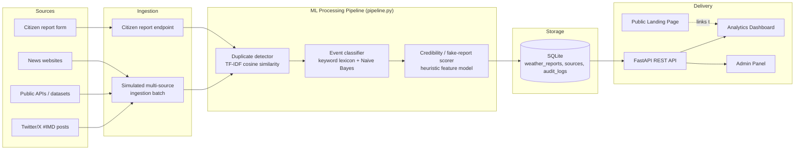

# Data Flow & Architecture

## Prototype architecture (what's actually running in this repo)

## Request lifecycle for one report

1. A post/report arrives (simulated batch tick, or a real citizen submission via `POST /api/reports/citizen`).
2. `pipeline.process_and_store()`:
   - Looks up or creates the `Source` (handle + type), carrying forward its running trust score.
   - Runs **duplicate detection** against same-city reports in a ±6 hour window (TF-IDF cosine similarity ≥ 0.62 ⇒ merged as duplicate).
   - Runs the **event classifier** (keyword lexicon blended with a TF-IDF + Naive Bayes model) to assign `event_category`, `category_confidence`, and an estimated `severity`.
   - Runs the **credibility scorer**, combining source trust history, clickbait/hedge-word signals, capitalisation/punctuation anomalies, presence of media, and corroboration count from nearby reports.
   - Reports scoring below 0.35 credibility are auto-set to `Auto-Flagged`; everything else starts as `Pending`.
3. The row is persisted to `weather_reports`, and the source's `total_reports` counter increments.
4. An admin reviews the Verification Queue and marks the report `Verified` or `Rejected`. This **feeds back into the source's trust score** (`+0.05` per verification, `-0.15` per rejection, auto-blacklist after 3 rejections with trust < 0.15) — a lightweight active-learning loop.
5. The Analytics Dashboard and public map query the same `/api/analytics/*` endpoints, which exclude duplicates and can filter by date, event, location, and verification status.

## Scaling path to a production-grade platform

| Layer | Prototype (this repo) | Production target |
|---|---|---|
| Ingestion | Synthetic batch generator + citizen HTTP endpoint | Twitter/X filtered stream API, Facebook/Instagram hashtag search, IMD AWS station polling, Kafka topics per source |
| Stream processing | Synchronous Python function calls | Apache Spark Structured Streaming / Apache Flink consuming from Kafka |
| Duplicate detection | Pairwise TF-IDF cosine similarity | MinHash-LSH or FAISS approximate-nearest-neighbour index, sharded by geohash + time bucket |
| ML classification | scikit-learn Naive Bayes + keyword lexicon | Fine-tuned transformer (e.g. IndicBERT) trained on IMD-labelled historical reports |
| Credibility scoring | Explainable heuristic feature blend | Supervised model (gradient boosting) trained continuously on admin verification decisions |
| Storage | SQLite (single file) | PostgreSQL/TimescaleDB for structured data + object storage (S3/MinIO) for media, optionally Elasticsearch for full-text search |
| Serving | FastAPI on a single process | FastAPI behind a load balancer, horizontally scaled, with Redis caching for dashboard aggregates |
| Visualization | Chart.js + Leaflet static pages | Same stack scales fine; consider a WebSocket channel for true push-based live updates instead of polling |

## Why simulated ingestion?

Live Twitter/X, Meta, and IMD AWS station feeds all require paid or
allow-listed API credentials that aren't available in a hackathon prototype
environment. `app_build/backend/ingestion/simulators.py` generates
realistic, India-specific weather posts (including occasional clickbait
noise) so every downstream component — classification, credibility scoring,
deduplication, dashboard, admin workflow — can be demonstrated end-to-end
with real data flowing through real code, not mocked API responses. The
`POST /api/ingest/simulate` endpoint is the only piece that would be
swapped for a live connector in production; everything after it is
production-shaped already.
